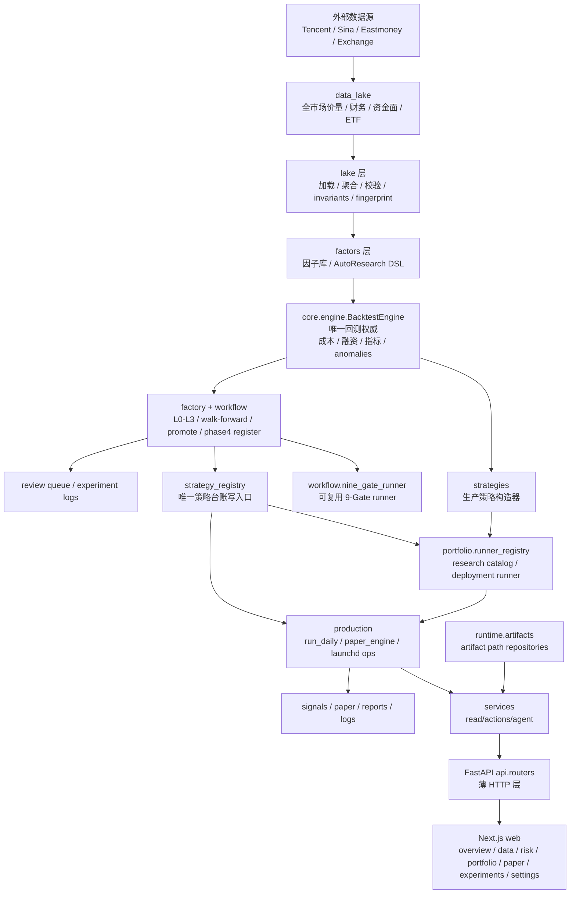

# SPEC — 系统规格与架构

> 系统"应该长成什么样"。操作约定见 [CLAUDE.md](CLAUDE.md),当前进度见 [STATUS.md](STATUS.md)。

## 目标与哲学
- 真正的资产 = 数据基础设施 + 自进化发现(策略工厂)+ 策略生命周期管理。
- 具体策略是易逝品,**默认会失效**;不追求单一永久达标策略,而是 工厂持续产出 → 管理层持续汰换 → 组合分散衰减。
- 门槛:单母策略入册 15%/20%;项目级(组合后)**双轨**——满意线 年化≥20% & 夏普≥1.0(已达),卓越线 年化≥28% 或 卡玛≥1.6。原 35%/15% 锚定 data_full 水分,已退役。

## 架构(自下而上;✅已建 / ⏳进行中 / ○未建)
1. **数据基础设施** `data_lake` ✅ — 全市场+全历史+含退市股的最全口径。
2. **统一回测内核** `core/` ✅ — `core.engine.BacktestEngine` 是**唯一**回测权威(`data_lake` 加载 + 因子/择时 + 真实买卖成本 + 融资成本 + 指标),生产与研究单一事实源。旧 `core.backtest` 兼容层已退场(`core/_deprecated_backtest.py.bak`),全仓迁移到 canonical 路径。
3. **策略工厂** ⏳ — 已建确定性网格、最小 NSGA-II、生态位搜索、review audit、孵化池、岛屿编排、扩展非小盘价量因子池、fundamental 正交因子池、fundamental 因子工程升级、两融资金面因子池和孵化池自进化;下一步围绕弱候选做本地规则化持续进化 + 自动证伪(过拟合/幸存者偏差/特定行情);**按母策略隔离进化(岛屿模型,见下「防同质化」)**。当前小规模搜索尚未产出 ≥2 个通过预审的非 small-cap 低相关候选。
4. **有效策略管理** ✅台账 / ○监控 — 母策略两层台账,跟踪 有效/衰减/退役。
5. **中央调度层** ✅/⏳ — launchd 四件套已建:daily-update / weekly-maintenance / api(:8011) / web(:3000) 常驻;event-driven 编排仍待建:数据就绪 / 市场状态切换 / 失效信号触发 → 启动或停用对应母策略/组合。
6. **组合层** ⏳ — 已有 paper_engine 自动模拟盘、债券 ETF 轮动和基础组合展示;多母策略低相关加权 / 轮换机制仍待建。
7. **展示层** ✅/⏳ — FastAPI + Next.js 看板已建。研究域按生命周期拆分：`/experiments` 只处理登记前的素材/草案/候选/L0-L3/复核，`/factors` 只展示已进入台账的版本、血缘和 Nine-Gate；专项验证按 `family/version` 聚合进版本详情。仍需把多母策略组合管理与衰减监控展示打磨成完整闭环。

- 核心循环:工厂产出 → 管理层汰换 → **只有「有效」策略才进组合与展示**。
- ⚠ 依赖顺序:组合/展示的收益必须建在 `core/` 真实成本口径上;旧 `data_full/data` 已清理,不得恢复为主线。
- 执行边界:**模拟盘自动执行**,真实账户**不自动下单**;实盘动作只给人工跟单参考。

### 运行态架构图(2026-06-30)
源文件:`docs/architecture_runtime.mmd`;图片:`docs/architecture_runtime.svg`。



### 模块解耦与单向依赖(2026-06-10 解耦收尾)
单向依赖链(`scripts/ci/check_layer_deps.py` 静态守卫,接入 `test_all.sh`):
```
data(lake) → factors → core.engine → {strategies(生产), factory/workflow(探索)} → registry → production
```
- 生产层(`run_daily`/`scripts/data`/`strategies`)**禁止**依赖 `factory.*`/`scripts.research.*`/`workflow.*`;探索层只消费 data/factors/core.engine 的稳定接口。
- **策略漏斗(候选→登记唯一通道)**:`factory/lines` 负责广度(变异生成 + L0 IC/L1 BT/L2 regime/L3 WF 廉价筛选,候选以 `factory.ontology.Hypothesis` 存于 `factory.pool`);L3_PASSED 经 `workflow/from_factory.py` 适配 → `workflow` phase1 合成防未来审计 → phase2/3 → `phase4_register` 登记 → `line3_marginal` 边际评级定 ACTIVE/SHADOW。驱动:`workflow/promote.py` 或 `python3 apps/factory_cli.py promote`。
- **9-Gate 可复用入口** = `workflow/nine_gate_runner.py`;`scripts/research/run_nine_gates_all.py` 只是 CLI 包装,不得作为 workflow 库依赖。
- **组合/runner 边界**:旧 strategy_runners 兼容模块仅做 re-export;研究目录在 `portfolio/research_catalog.py`,部署解析在 `portfolio/deployment_runner.py`,查询入口在 `portfolio/runner_registry.py`。
- **运行产物路径边界**:`runtime/artifacts.py::ArtifactPaths` 集中表达 `data_lake/reports/paper/signals` 布局;API 层不得直接读写 artifact,只经 `services.read`/`services.actions`。
- **台账唯一写入口** = `strategy_registry.register_family/register`(经 `phase4_register`);禁止任何代码直写 `strategy_versions.json`。
- `phase1_synthetic` 是**全系统唯一**机械执行「防未来函数」铁律的闸门。

### Web 研究域边界（2026-06-21）

- 统一只读模型 `ResearchWorkItem` 聚合 draft / Hypothesis / AutoResearch Candidate，但不合并底层 append-only 存储；身份使用 `draft:{id}`、`hypothesis:{id}`、`autoresearch:{fingerprint}`。
- 统一状态为 `review / blocked / ready / running / completed / archived`，默认按人工动作优先排序；同一工作项同一动作只允许一个运行中 Job。
- 研报逻辑链只能生成待补全的研究草案；具备经济机制、可执行因子函数和数据依赖后才可进入 L0。
- 人工与 AutoResearch 共用 append-only 复核记录；L3 未批准时 API 必须拒绝晋级。
- `/factors` 的对象是台账版本，不是未登记候选；台账 `候选/SHADOW` 在 UI 中称“观察版本”。
- 专项 JSON 产物通过 research ledger 的 `hypothesis=family/version` 绑定到版本详情，前端不硬编码业务文件路径。

## 数据层设计
- **口径**:全市场+全历史+含退市股(`data_lake`);估值用不复权价、财务按公告日对齐(防未来函数)。
- **增量更新** ✅:`scripts/data/update_lake.py::update_prices()`,集成于 `run_daily.py` 第①步。
- **维护** ✅:`scripts/data/build_*`(建湖/财务/ST历史)、`scripts/repair/*`(日历/坏值修复)、`validate_final.py`(质量校验 ~99.9%)。
- **数据源** `lake/sources/`:tencent(主力后复权)、sina、em_fin(东财批量财务 `yjbb_em`)、exchange(两融/北向)。
- **fundamental 因子池**:策略工厂使用 `fundamental_batch.parquet` 的 ROE、毛利率、经营现金流、收入/利润增速、EPS TTM、BPS、industry,按 `avail_date` 对齐;价值类收益率因子用不复权价计算,避免复权价估值量纲错误。工程化因子包括行业内排名、行业中性残差、财务变化率、估值时间分位、质量+价值 regime 过滤。
- **capital 因子池**:两融已落 `data_lake/capital/margin_all.parquet`,字段包括融资余额/融资买入额/融券余额/融券余量;北向 fallback 已落 `data_lake/capital/northbound_all.parquet`,覆盖 2017-2024 的高流动性北向持股历史。factory 按 T+1 可用对齐,构造融资余额变化率、融资买入占比、融券余额变化、北向持股占比/市值/变化/净买入强度等资金面因子。验证结论:两融和北向均未产生合格第二母策略。
- **调度** ✅/⏳:`scripts/ops/scheduled_daily_update.py` 每日盘后执行价量/财务/ETF 增量 + stale gate + 信号生成 + 自动模拟盘;`scripts/ops/scheduled_weekly_maintenance.py` 做周/月线、不复权价、完整质量校验;FastAPI :8011 和 Web :3000 由 launchd KeepAlive 常驻。完整事件驱动仍归入中央调度层。

## 母策略台账 schema(两层,`strategy_registry.py`)
- **母策略 family**:`id / name / hypothesis / regime / decay_signal / status`(active·paused·retired)
- **版本 version**:`version / desc / config / data_scope(源·区间·幸存者偏差) / metrics / status / notes`(版本 status:候选·在册·退役·参考)
- 数据口径是**版本属性**,不占版本号语义。API:`register_family()` 声明母策略 → `register()` 挂版本。

## Policy 层 VetoFilter(观察态)
- 通用实现入口:`factor_research/research_toolkit/` 是策略研究与控制规则验证工具箱,承载 HostSpec、ControlArtifact、candidate-pool policy、marginal delta report 和 discard-pile triage 等宿主无关能力。
- **本体**:`VetoFilter` 是挂在宿主策略上的排除规则,不是独立策略或普通选股因子;没有独立净值,只能报告相对宿主的边际贡献。
- **接入点**:宿主权重构造器在 `top_n` 选择前过滤候选池,从幸存候选中补满仓位;只在调仓日生效,T 日截面分位 → T+1 生效,不做盘中踢仓。
- **评估协议**:`scripts/research/veto_filter_marginal.py` 同一引擎/同一成本跑宿主带/不带 veto,输出 Δ年化、Δ回撤、Δ换手、Δ成本和逐年分解;禁止输出或宣传 veto 独立收益。
- **工厂回路**:`factory/lines/line2_validation/veto_triage.py` 对 L1 已死但 L0 |ICIR| 仍强的候选给出 veto-review 路由,不改变 L0-L3 主线状态。
- **状态门控**:当前只能登记为 `条件假设/观察`;不做拟合式 regime gate,等真实 OOS 观察积累后再单独立项。

## 防同质化(逼出低相关母策略,三层)
- **岛屿隔离**(过程层):各母策略独立种群 / 输出目录 / 可选 git worktree,互不污染。**生态位差异化**(不同数据源/因子族/regime)是低相关的根 —— 隔离本身只防污染,不保证结果低相关。岛间不迁因子基因,只共享方法。
- **NSGA 多目标**(岛内层):多头 NDCG@k + 时序稳定 + 真实绩效,不退化成单目标。
- **review audit**(候选层):`*_review.json` 入围后必须过 2018/2023/2010 三段复测 + 成本上浮敏感性,再进入台账预审;未过预审但低相关/有逻辑/局部有效的候选进入孵化池,不得直接入册。
- **incubation evolution**(孵化层):本地规则化变异参数/因子/权重 = `factory/lines/line1_generation/mutate_existing.py`(按 `FACTOR_MUTATION_SPECS` 的 `param_grid` 扰动现有因子,纯规则、不调 LLM/OpenAI API,避免把本地长跑与模型限流混淆);每代变异体重新走 `factory/lines/line2_validation`(gates + walk-forward)复验,未过预审者留孵化池、不得直接入册。(老 `factory/evolve_incubation.py` 已随老工厂在 `917b1edc6` 删除,能力迁入 Line1/2/3 新产线。)
- **VIF + 逻辑闸**(入册层):跨策略收益 VIF 低相关 + `hypothesis` 逻辑独立。

## AutoResearch 搜索目标函数(四项适应度,`factory/autoresearch/islands.py`)
进化搜索按下式排序,核心思想 = **把 L1 的事后筛选压力前置进搜索目标**(否决器/相关/换手都是"裁判知道的事,选手也该知道");同一套 canonical 验证线,无第二口径。

```
fitness = |ICIR|                         # run_l0 的独立 edge(毛信号)
        + novelty_weight  × 行为新颖性    # 默认 0.25
        − corr_weight     × 对在册组合相关 # 默认 0.30(服务层开,引擎层默认 0 保可复现)
        − turnover_weight × 换手代理       # 默认 0.15
```
- **行为新颖性**(`novelty.novelty_score`):候选因子面板 vs 已评估档案+在册参考的最近邻行为距离(|spearman| + top 分位 Jaccard);填未占领的因子形态生态位。
- **对在册组合相关**(`novelty.max_return_correlation`):候选 top-N 收益代理与在册 ACTIVE 腿的**有符号**最大相关——同涨同跌罚、反相关(防御腿)奖。参考腿 = `services.actions.autoresearch_search.active_book_panels`(small-cap+illiquidity);walk-forward 经 `reference_builder` **只在 ≤cutoff 截断面板上构造**(元级防未来)。
- **换手代理**(`novelty.topn_turnover`):top-N 成员相邻期 Jaccard 流失率 ∈[0,1];前置 ~12pp/年的成本压力,并抵消 corr 项对反转(高换手)的偏好。

**设计依据**:伪多样性审计(`registry_correlation_audit.py`)在册 5 股票腿两两相关 0.76、尾部 0.69——标量 |ICIR| 结构上只会复制小盘风险溢价,找不到去相关/低换手的防御腿。

**A/B 实证**(同种子同数据,隔离单变量):
- 去相关(`marginal_fitness_ab.py`):cw 0→0.3,冠军对在册均值相关 **0.60→0.26**,去相关冠军 1/5→4/5;惩罚是倾斜非硬筛(高 edge 带 0.63 相关仍留榜)。
- 换手(`turnover_fitness_ab.py`):tw 0→0.15,冠军均值换手 **0.58→0.30**(腰斩),毛 |ICIR| 0.62→0.52(预期代价:最高 IC 恰最 churn)。
- 净收益(`turnover_ab_l1_net.py`):两臂走 L1 真实成本,换手臂净年化 **+5.8% 反超基线 +3.6%**——毛 ICIR 与净收益在反转票上**反号**,证明成本必须前置。

**跨资产**:防御腿(国债 MA60 Δsharpe +0.64、黄金第二腿)是单资产择时,不属截面选股 DSL;经同一边际透镜独立搜索(`cross_asset_leg_search.py`),统一层是目标函数不是白名单。

**诚实边界**:① 换手惩罚拿尾部高 IC 赢家换一致性,0.15 是保守权重(再高会误杀"毛 edge 大到扛得住高换手"的赢家);② 真投资性闸门是回撤(择时),与本目标函数正交;③ 四项只决定**提案质量**,L0-L3 验证闸门一个数字没动,裁判始终独立。

## 成本模型
见 CLAUDE.md「交易成本」表。代码默认 `CostModel`:买 0.225% / 卖 0.275% / 融资 6.5%;佣金/融资可谈,冲击滑点维持审慎不乐观化。
