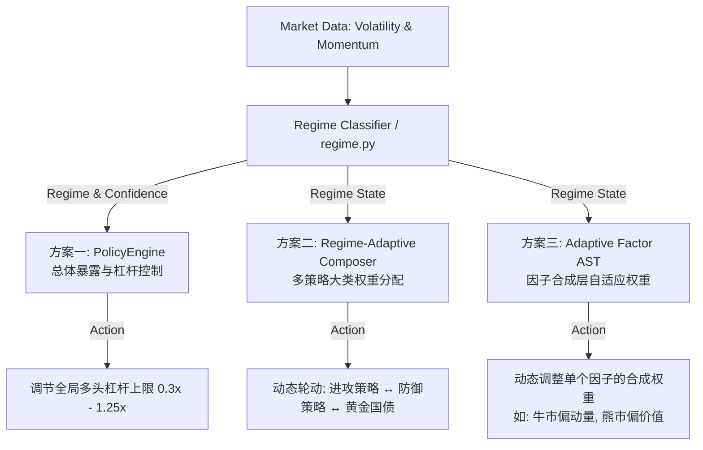

# A股多策略自适应状态调节系统设计提案 (Adaptive Strategy System Proposal)

本提案旨在解决单一因子的硬开关择时算子（如 `regime_gate` 均线阻断）在牛市中产生的**严重拖累与踏空磨损（牛市年化收益由 82.47% 跌至 54.17%）**。
我们将基于系统中现有的状态检测基础 [regime.py](file:///Users/kiki/astcok/factor_research/portfolio/regime.py)，探讨三种不同维度（组合总量风控、大类策略分配、因子合成层面）的动态状态调节方案。

---

## 现有的状态检测底座 (Regime Detector Foundation)
在 [regime.py](file:///Users/kiki/astcok/factor_research/portfolio/regime.py) 中，系统已沉淀了如下基础能力：
1. **5大市场状态分类 (`classify`)**：基于 realized volatility (20d) 和 annualized momentum direction (60d) 的自适应分位数，将每一天划分为：`bull` (牛市)、`bear` (熊市)、`chop` (震荡)、`panic` (恐慌崩盘)、`upside_crisis` (局部暴涨，如小盘疯牛)。
2. **状态置信度评估 (`calculate_regime_confidence`)**：利用状态的滚动持续性（Persistence）输出 0~1 的置信度（频繁切换则置信度低，平稳则置信度高）。
3. **防御腿质量评级 (`defensive_grade`)**：用于评测候选策略在大盘熊市期是否具有“少输钱”（输钱幅度显著小于 live 主策略均值）和低相关性特征。

下面针对如何在此之上建立**状态调节系统**进行三种方案的深度对比。

---



---

## 方案一：PolicyEngine 总体风险暴露控制 (Institutional Risk Budgeting)

### 1. 设计思路
完全解耦“子策略选股”与“风险控制”。子策略不管大盘牛熊，始终输出最纯粹的因子多头持仓；由全局的 [PolicyEngine](file:///Users/kiki/astcok/factor_research/portfolio/regime.py#L178) 担任“总阀门”，根据市场状态和置信度，动态控制整体持仓上限和杠杆上限。

### 2. 实现细节
* 在回测引擎 [BacktestEngine](file:///Users/kiki/astcok/factor_research/core/engine.py#L309) 和盘后更新 [run_daily.py](file:///Users/kiki/astcok/factor_research/run_daily.py) 中接入 `PolicyEngine`：
  ```python
  # 根据当前所处状态和状态持续置信度，决定最大风险暴露上限 (Max Exposure Limit)
  max_exposure = policy_engine.get_max_exposure(current_regime, confidence)
  # 若状态为 bear / panic 且置信度高，强制将杠杆降至 0.30x (基本空仓避险)
  # 若状态为 bull / upside_crisis，允许恢复至 1.25x (杠杆满额攻击)
  ```
* 资金调仓通过等比例缩放（Scaling）多头头寸权重来实现，溢出资金自动存入现金账户赚取活期/回购利息（或降低融资占比）。

### 3. 优劣势分析
* **优势**：
  * **结构极简，易于回测**：子策略无需重复计算，直接在回测最外层拦截并缩放 returns，计算开销极低。
  * **完全防御未来信息泄露**：置信度公式基于历史状态的持续性，不带有任何前瞻预测成分，不易过拟合。
  * **因子纯度高**：不干扰任何单个因子的选股逻辑和 Alpha 独立分布。
* **劣势**：
  * **颗粒度过粗**：属于“一刀切”式的一总量阀门。当发生状态误判或滞后时，容易造成全局多头策略同步踏空，无法实现子策略间的精细风险对冲。
  * **资金闲置成本**：在熊市状态下会产生大量的现金闲置，未能主动将仓位转移到防御性非对称资产（如国债/黄金）中获取超额收益。

---

## 方案二：Regime-Adaptive Composer 多策略大类权重分配 (Dynamic Multi-Strategy Allocation)

### 1. 设计思路
利用不同风险属性的子策略（进攻型：小盘动量、illiq 因子；防御型：成长大盘、红利价值；保险型：国债、黄金）在不同牛熊状态下的**非对称收益特性**，在组合层面进行动态权重再分配。

### 2. 实现细节
* 改造 [composer.py:regime_adaptive](file:///Users/kiki/astcok/factor_research/portfolio/composer.py#L55) 的组合逻辑：
  ```python
  def regime_adaptive_weights(regime, confidence):
      # 状态 1：BULL / UPSIDE_CRISIS (牛市/疯牛)
      #   -> 分配 90% 权重给进攻型子策略(小盘动量、高换手超额)，10% 给防御腿(保险封顶)。
      # 状态 2：BEAR / PANIC (熊市/崩盘)
      #   -> 将防御腿权重上限从 30% 放大到 70%~100%，或者主动分配 50% 以上给低 Vol 的基本面策略/成长大盘。
      # 状态 3：CHOP (平淡震荡市)
      #   -> 自动切换至标准风险平价 (Risk Parity) 模型，按子策略的日滚动波动率倒数分配权重，压制噪声。
  ```

### 3. 优劣势分析
* **优势**：
  * **资产轮动与分散避险**：符合现代机构大类资产配置逻辑。在熊市中不是单纯的空仓等待，而是主动把资金引流至黄金、国债、低波红利等“天然避风港”或逆市因子，实现收益源的多样化。
  * **牛市无拖累**：在确立的牛市状态下，大幅降低防御腿权重（如从 30% 降至 5%~10%），能够完全释放小盘因子的暴击收益，规避了静态 `capped` 30% 权重对牛市收益的稀释。
* **劣势**：
  * **调仓摩擦成本高**：由于在不同策略（小盘 vs 大盘 vs 债券）之间腾挪资金，每次状态切换都会触发大量的跨策略平仓与建仓，滑点和过户费损耗很大，需要配对严格的“换手平滑滤波器”（如增加切换冷却期或设定高置信度门槛）。
  * **对子策略池的完备度要求高**：需要拥有足够丰富且真正低相关的防御性策略储备（如果策略池里全是在熊市里一起暴跌的顺周期因子，权重如何调整都无济于事）。

---

## 方案三：Factor-Level Adaptive Weighting 因子合成层的状态自适应加权

### 1. 设计思路
将市场状态的逻辑下沉至因子最底层的“合成阶段”（Linear Combo AST 树）。单个子策略内部包含的多个基础因子，其合成权重不再是静态常数，而是随着当前大盘牛熊状态动态变化的函数。

### 2. 实现细节
* 在 [autoresearch_dsl.py](file:///Users/kiki/astcok/factor_research/factors/autoresearch_dsl.py) 中，重构因子合成公式。权重 $w_i$ 由常数变为状态敏感变量：
  $$\text{Composite Factor}_t = w_1(\text{regime}_t) \times \text{Factor}_{1, t} + w_2(\text{regime}_t) \times \text{Factor}_{2, t}$$
* 例如，在一个混合了“动量”和“低估值价值”的子策略中：
  * 当 $\text{regime}_t = \text{BULL}$：$\text{Composite Factor}_t = 0.8 \times \text{Momentum} + 0.2 \times \text{Value}$ (牛市偏动量顺势)；
  * 当 $\text{regime}_t = \text{BEAR}$：$\text{Composite Factor}_t = 0.1 \times \text{Momentum} + 0.9 \times \text{Value}$ (熊市偏价值防守)。

### 3. 优劣势分析
* **优势**：
  * **极高的精细度**：直接在信息源头（因子载荷分布）上进行清洗 and 变形。使单个子策略在多头持仓筛选阶段，就能自动根据环境筛选出最适宜当天状态的个股篮子。
  * **数学解构完美**：能够使单个因子的全样本 ICIR 和分位表现达到极致，在最底层就完成了牛熊表现的非对称优化。
* **劣势**：
  * **极易发生“回测过拟合谬误” (Backtest Overfitting)**：这是最致命的缺点。给岛屿演化引擎（Auto-Research）引入了状态敏感权重的自由度后，算法极易在历史特定的突发事件窗口（例如 2015、2024年初）“脑补”出过度拟合的假状态加权规则，导致样本外表现（OOS）瞬间塌陷。
  * **计算爆炸**：由于每一次状态切换都需要在截面上重新解构因子的相对排序，因子面板的缓存（Memoization）机制将大面积失效，单代演化的长跑计算时间将成倍上升。

---

## 三大方案对决总结 (The Trade-Off Matrix)

| 评估维度 | 方案一：PolicyEngine (总量控制) | 方案二：Regime-Adaptive Composer (策略分配) | 方案三：Factor-Level Adaptive (因子合成) |
| :--- | :--- | :--- | :--- |
| **控制层次** | 全局资金/杠杆阀门 | 多策略大类权重分配 | 因子底层合成权重变动 |
| **开发与计算复杂度** | 极低（直接拦截 NAV 缩放） | 中等（需子策略 returns 对齐与换手控制） | 极高（需重构 DSL 解析器，缓存大面积失效） |
| **过拟合与泄露风险** | 极低（无前瞻，逻辑解耦） | 中等（需通过 Walk-Forward 控制权重参数） | **极高（极易搜出假组合结构）** |
| **牛市收益释放度** | 良好（牛市满杠杆，不拖累） | **优秀（能主动剔除防御腿的稀释）** | 优秀（个股篮子自适应） |
| **熊市防守能力** | 良好（空仓守现金） | **优秀（能轮动到黄金/国债主动生息）** | 中等（依赖多头池内是否有抗跌股） |
| **当前代码就绪度** | 框架已实现，未在生产端集成接线 | 框架已实现，未在生产端集成接线 | 零就绪（需全面重构编译器 and 岛屿突变算子） |

---

## 决策建议与下一步规划

根据 **CLAUDE.md** 中 “Simplicity First (简单优先)” 和 “Goal-Driven Execution (目标驱动)” 的铁律，建议我们**不要急于挑战过拟合风险极高的方案三**，而是按以下路径逐步推进：

1. **第一步（设计对齐）**：我们先就上述不同方案的优劣势进行讨论。
2. **第二步（接线与整合）**：若您决定推进，我们将开始规划如何打通和激活现有的 [regime.py](file:///Users/kiki/astcok/factor_research/portfolio/regime.py) 和 [composer.py](file:///Users/kiki/astcok/factor_research/portfolio/composer.py) 的接线逻辑，使它们正式进入回测引擎 [BacktestEngine](file:///Users/kiki/astcok/factor_research/core/engine.py#L309) 和生产日更中。
