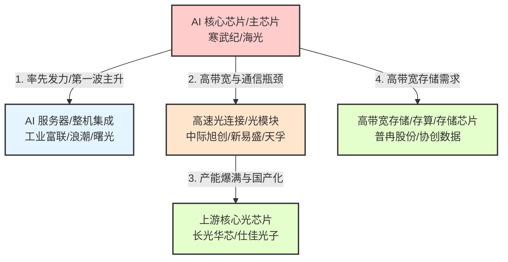

# A股算力产业链涨幅传导与扩散逻辑深度解析报告

通过对 2024 年 6 月至 2026 年 6 月算力板块核心个股的月度累积涨幅分析，可以清晰地观察到资金与景气度在 AI 算力产业链上的**传导路径**。这种“涨幅传导”并非随机，而是由**产业订单落地顺序**、**技术瓶颈转移**以及**估值性价比轮动**共同决定的。

---

## 一、 算力产业链传导结构模型

在 AI 算力的建设浪潮中，需求和资金的传导大体遵循以下路径：

---

## 二、 产业链扩散的三个关键时间节点

结合 2024-06 至 2026-06 的具体数据，算力产业链的扩散呈现出显著的“时序差”：

### 1. 2024年下半年：核心主芯片一马当先（芯片 $\rightarrow$ 其他静默）
* **产业链位置**：**下游算力底盘（GPU/NPU芯片）**
* **数据表现**：
  * 截至 2024 年 12 月，**寒武纪** 录得 **$3.19x$** 的累积涨幅，**海光信息** 录得 **$2.03x$**。
  * 同期，光模块龙头 **中际旭创** 仅为 **$0.88x$**（仍处于负增区间），上游光芯片 **长光华芯** 仅为 **$1.15x$**。
* **产业逻辑**：
  A 股的炒作和机构建仓首先锚定的是**壁垒最高、弹性最大、最具备自主可控紧迫性**的芯片环节。作为 AI 的“心脏”，算力芯片是整个产业链景气度的“发令枪”。在没有看到订单出货的验证前，资金选择集中在芯片进行确定性押注。

### 2. 2025年下半年：光网络瓶颈爆发，光模块垂直冲刺（芯片 $+$ 光连接双击）
* **产业链位置**：**中游光连接（光模块、光器件）**
* **数据表现**：
  * 在 2025 年 6 月，中际旭创累积涨幅仅为 $1.04x$，但到了 8 月瞬间飙升至 **$2.52x$**，12 月冲至 **$4.34x$**。
  * **新易盛**、**天孚通信** 同步在此阶段完成了从 $1.0x$ 级别向 $3.0x - 4.0x$ 级别的跨越。
* **产业逻辑**：
  随着英伟达等全球大厂对 AI 集群架构（如 NVLink）的升级，算力芯片的算力提升导致**通信带宽成为集群的致命瓶颈**。光模块（尤其 800G/1.6T 核心品类）的需求量呈现数倍增长。由于中国企业（如中际旭创、新易盛）在光模块代工和研发上占领全球 60%+ 的份额，其**订单落地速度和业绩爆发性最先在财报上得到验证**，引爆了中游光网络板块的垂直冲刺。

### 3. 2026年上半年：瓶颈向上游核心材料和存储蔓延（存储 $+$ 光芯片补涨狂欢）
* **产业链位置**：**上游核心芯片（光芯片、存储芯片/存算）**
* **数据表现**：
  * **长光华芯（光芯片）** 在 2025 年底仅为 $3.67x$，但到 2026 年 5 月暴涨至 **$11.51x$**（最高峰值曾达 $13.06x$）。
  * **普冉股份（AI 存储芯片）** 在 2025 年 12 月仅为 $1.85x$，但 2026 年 1 月暴拉至 **$4.44x$**，并在 6 月达到 **$10.20x$**。
  * **协创数据（算力存储）** 在 2026 年 6 月收盘累积涨幅也冲至 **$10.30x$**。
* **产业逻辑**：
  这是典型的**产业链传导终极阶段**。
  * **光芯片端**：中游光模块大量出货（中际旭创等市值冲至数千亿）后，上游的激光发射芯片（如 EML 芯片）产能供不应求，成为新的卡脖子环节。长光华芯等自主光芯片研发企业迎来爆发。
  * **存储端**：随着算力主芯片（GPU）处理能力的极限提升，数据读取的“内存墙”（Memory Wall）瓶颈凸显，高带宽存储（HBM）和周边存储主控芯片供需极度失衡，促使普冉股份等企业在 2026 年初迎来业绩和估值的暴增。
  * **估值轮动**：中下游白马市值过高（如中际旭创、寒武纪已在历史高位盘整），机构资金向下游寻找具备技术突破和补涨空间的上游零部件/材料企业，引发上游板跨的集体狂欢。

---

## 三、 板块传导总结与启示

A股算力板块在这两年间的扩散路径可以总结为：
$$\text{核心算力芯片 (2024H2)} \rightarrow \text{高弹性光模块/光器件 (2025H2)} \rightarrow \text{上游光芯片/存储芯片 (2026H1)}$$

* **领先指标**：核心芯片（寒武纪）和中游大白马（中际旭创），是全周期行情的风向标。
* **弹性指标**：光连接（中际旭创、新易盛）和上游特种芯片（长光华芯、普冉股份），涨幅最晚但斜率最陡峭，单月暴发性极强。
* **稳健分流**：AI 服务器整机（工业富联、浪潮信息）作为算力建设的刚需，呈现慢牛特征，其涨幅波动较小（全周期在 $1.8x - 2.8x$ 之间），承接了大容量资金的平稳避险配置需求。
