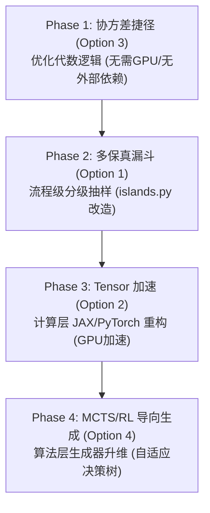

# A股因子演化系统性能跃升方案实施蓝图 (Roadmap)

为了实现量化因子挖掘效率的代级跨越，我们将前述四个正交加速方案解耦为**四个独立、渐进的研发阶段**。这套规划在保证系统稳定性与真实回测不泄露的前提下，步步为营、逐级提速。

---

## 📅 阶段分步规划一览

---

## 🛠️ 各阶段详细设计与实施路径

### 🔹 Phase 1: 协方差与换手率的“代数捷径” (Option 3)
* **核心任务**：
  将 GA 寻优计算中针对“组合相关性” (`corr_to_book`) 和“换手率估计” (`turnover`) 的**模拟盘建仓计算**，升级为**矩阵特征解析求解**。
* **实施步骤**：
  1. 在 `run_island_search` 开始时，一次性计算 47 个基础因子面板在采样交易日（`sample_dates`）上的**截面 Spearman 相关性矩阵（$\Sigma_{47 \times 47}$）**。
  2. 针对任何线性组合候选策略（如 $w_1 \cdot f_1 + w_2 \cdot f_2$），其与在册策略的收益相关性，直接由公式 $w^T \Sigma_{\text{book}} w$ 进行代数计算，不再生成任何持仓矩阵。
* **预估提速**：**~30%** 的单次评估时间缩短（完全省去大量 DataFrame 的截面排序和收益模拟开销）。
* **技术优势**：纯 Python/Numpy 更改，零外部依赖，极易上线与验证。

---

### 🔹 Phase 2: islands 流程级“多保真度漏斗” (Option 1)
* **核心任务**：
  实现渐进式样本量初筛，将最昂贵的全样本回测分配给极少数潜力股，彻底消灭“无效垃圾因子的全量计算”。
* **实施步骤**：
  1. **Level-1 极速初筛（保真度 10%）**：新生成的变异算子先在随机 **20 个** 交易日上计算 IC。若 $|IC| < 0.02$，直接拒识并重新变异。
  2. **Level-2 中期评估（保真度 40%）**：通过 Level-1 的个体，在 **60 个** 交易日上评估其 ICIR，过滤掉后 50%。
  3. **Level-3 完整评估（保真度 100%）**：通过 Level-2 的前代精英，在 **120 个** 交易日上运行 L0 Scan，进入 GA 适应度计算。
* **预估提速**：**3x ~ 5x 提速**。由于过滤了 80% 的突变垃圾，实际调用回测引擎的次数呈指数级减少。
* **技术优势**：修改局限于 `islands.py` 的繁衍机制中，对底层回测引擎无污染。

---

### 🔹 Phase 3: 计算引擎 JAX / PyTorch Tensor 化重构 (Option 2)
* **核心任务**：
  将 15 年全时段 5207 股票矩阵的运算，从 CPU 上的 Pandas 单线程向量化计算移植到 **GPU / Apple Silicon Metal** 显存中，实现千级并行计算。
* **实施步骤**：
  1. 使用 JAX (或 PyTorch) 编写 Rank IC、Rolling operation、Z-score 和 MAD-clip 的张量加速函数。
  2. 利用 JAX 的 `@jit` 装饰器将代数公式实时编译为底层 GPU 指令。
  3. 利用 `vmap`（Vectorized Map）机制，一键并发计算 1000 个变异表达式的 Rank IC。
* **预估提速**：**10x ~ 100x 的跨代提速**，让大范围复杂搜索耗时直接从小时级降为秒级。
* **技术优势**：完全吃满 Apple Silicon（M5 统一内存架构）或显卡集群的并行带宽。

---

### 🔹 Phase 4: 因子生成器 MCTS / 强化学习升级 (Option 4)
* **核心任务**：
  将 GA 种群“无向变异”升级为“策略网络导向生成”，让生成器学会“像高级研究员一样组合算子”。
* **实施步骤**：
  1. 将 AST 表达式构建定义为**马尔可夫决策过程 (MDP)**：每个动作（Action）代表添加一个因子节点（如 `roe`）、窗口参数（如 `60`）或变换算子（如 `zscore`）。
  2. 搭建以 9-Gate 最终回测的夏普比率/边际贡献作为奖励（Reward）的**强化学习环境 (Environment)**。
  3. 采用 PPO（近端策略优化）或 **MCTS（蒙特卡洛树搜索）** 训练一个轻量级策略网络，指导变异方向。
* **预估提速**：提升**搜索质量与收敛速度 5x 以上**（可以用极小的迭代代数找到超额收益策略）。
* **技术优势**：实现挖掘系统的高智能化与完全自适应，能够自动避开垃圾因子的死胡同。

---

## 📈 长期演化兼容性说明

### 📌 接入新数据（Tick数据、非结构化 Alternative 数据）的稳健性
1. **多保真度漏斗 (Phase 2)** 是处理大规模 Tick 级高频数据的**生命线**。在高频数据下，不经过 Level-1 极速初筛（如仅在 1 个小时的数据上筛选），全量计算完全不可行。
2. **GPU Tensor 加速 (Phase 3)** 天生契合三维的高频 Tick 张量（`日期 × 股票 × 逐笔时序`），是未来进军高频领域的硬核物理基础。
3. **协方差捷径 (Phase 1)** 的代数算子在基础特征扩展时（例如加入舆情数据），只需将特征矩阵维度从 $47$ 增至 $47+N$，计算量呈线性级微增，数学表达式完全不需要重写。
